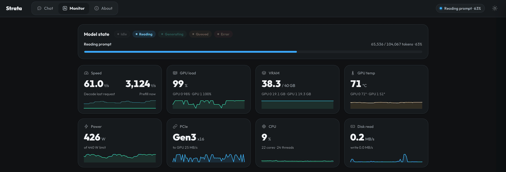
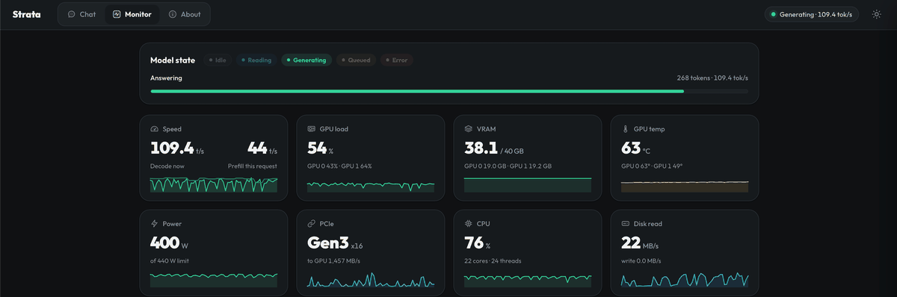

# Community benchmark: 2x RTX 3080 20 GB, Xeon E5-2696 v4, UD-Q4_K_XL, 512k-token shared KV pool

I measured this on 2026-10-08 ([noon-at-cgn](https://github.com/noon-at-cgn)).

I run Qwen3.8-Flash-Next at UD-Q4_K_XL (104 GB) on a used server I built for about $2,000. A 2016 Xeon and two RTX 3080 20 GB cards read a 104K-token prompt at a median 2,996 tok/s and decode at a median 86 tok/s, with two 262,144-token lanes sharing one 524,288-token KV pool.

This tests Strata with the Unsloth UD-Q4_K_XL quant of Qwen3.8-Flash-Next (a 4-bit K-quant, 103.7 GiB of GGUF files) on two consumer 20 GB cards, with
`--max-context 262144`, two serving lanes of 262,144 tokens each, and one 524,288-token KV pool shared by both lanes.

**This report is a fork build on the 0.1.40.3 base. It does not reproduce from upstream `main` plus the open pull
requests.** The engine here is my fork's build (`strata-w7`). It depends on four changes that are in neither upstream
`main` (`fb58e0d`) nor [#1598](https://github.com/Niko1221/Strata/pull/1598)-[#1601](https://github.com/Niko1221/Strata/pull/1601):
the shared KV pool (`--kv-pool-tokens`, my open PR [#1614](https://github.com/Niko1221/Strata/pull/1614)), `--batch-mtp`
on a layer split (my open PR [#1636](https://github.com/Niko1221/Strata/pull/1636)), `--adapt-async` beside `--batch`
slots (my open PR [#1637](https://github.com/Niko1221/Strata/pull/1637), stacked on #1636), and
[#1190](https://github.com/Niko1221/Strata/pull/1190) (resident split lend regions; an open PR by evaanp, not mine, not
in `main`, currently conflicting). With a layer split and prefill borrowing, #1190 keeps a RAM copy of the lend regions,
which the "no disk reads while serving" behaviour of this setup requires. I did not measure how much the numbers depend
on #1190.

To get the binary I measured, build branch `repro/w7` (commit `428d9910134aaaae9ffd8c8e262cec39504221e5`) on
[noon-at-cgn/Strata](https://github.com/noon-at-cgn/Strata/tree/repro/w7): it is upstream v0.1.40.3 plus my patch stack.
Everything in it that is not in upstream `main` is listed below. See
[Source of the binary](#source-of-the-binary-and-what-is-not-upstream) for the branches and commit ids.

Median results on the production engine, from the community harness (`benchmark.py`, unmodified), 3 runs per length,
256-token output cap, greedy:

| Prompt tokens | Prompt tok/s, median (range) | Decode tok/s, median (range) | Time to first token, s |
| ---: | --- | --- | --- |
| 4,096 | 718 (708-740) | 81.2 (58.6-85.9) | 5.8 |
| 25,000 | 2,219 (2,149-2,242) | 84.0 (79.3-85.5) | 11.4 |
| 51,000 | 2,585 (2,515-2,601) | 90.6 (89.0-91.8) | 19.9 |
| 104,000 (103,999 actual) | 2,996 (2,945-3,016) | 86.3 (85.0-88.4) | 35.1 |
| 127,000 | 3,080 (3,066-3,104) | 80.7 (78.1-90.8) | 41.7 |

Two concurrent streams, my own script (not the harness), 12 rounds x 2 identical arms: **89.5 tok/s aggregate**
median (75.4-97.2, n = 24). One stream, the same script: 78.3 tok/s median (68.4-92.1, n = 24).

The whole build cost about US$2,000 (see [My build](#my-build)).

## Hardware and software

### My build

- Board: MACHINIST X99-MR9A PRO MAX (one socket)
- CPU: Intel Xeon E5-2696 v4 (2016), 22 cores / 44 threads, up to 3.7 GHz, 55 MB L3, AVX2, no AVX-512
- RAM: 4 x 32 GB DDR4-2400 (Hynix) = 128 GB
- GPUs: 2 x RTX 3080 20 GB, each PCIe Gen3 x16, each limited to 220 W
- Storage: Samsung 512 GB NVMe (the model lives here) and 2 x Seagate 8 TB hard disks (other containers)
- OS: Proxmox VE 9.2 host. Strata runs in an LXC with 90 GiB RAM and 24 threads
- Cost: about $2,000 for the whole build

What I read from the host and the container during the run:

| | |
| --- | --- |
| GPU | 2x NVIDIA GeForce RTX 3080 20 GB (sm_86), driver 615.71.09 (`nvidia-smi` 580.178.04 header, CUDA 13.4 reported), 40,960 MiB total VRAM |
| Power | 220 W limit per card (stock default 320 W), 440 W for the pair |
| GPU link | PCIe Gen3 x16 per card, both cards behind the CPU's host bridge (`PHB`), no NVLink. The link read Gen3 x16 in 222 of 223 samples of `data/gpu.csv` (Gen1 x16 in the first, idle sample) |
| CPU | Intel Xeon E5-2696 v4 @ 2.20 GHz, 22 cores / 44 threads on the host, 24 logical CPUs visible in the container; AVX2, **no AVX-512** (the engine's start line says so) |
| RAM | 90 GiB visible in the container (LXC limit; `MemTotal` 94,371,840 kB), swap 8 GiB (2.4 GiB in use during the run) |
| Storage | model on a 150 GB thin-provisioned volume (`/dev/mapper/pve-vm--105--disk--0`, 113 GB used), shared with other containers on the host. A cold start of the engine takes about 3 minutes |
| OS | Ubuntu 24.04.5 LTS in a Proxmox LXC container, host kernel 7.0.14-16-pve |
| Engine | Strata engine 0.1.40.3 (as the engine reports it), **my fork's build `strata-w7`**, sha256 `b1df9608295501f0c67f51bef3cfd2831c7e60fb7369866f00b980ff766a1283`; source below |
| Build | CMake Release, `CMAKE_CUDA_ARCHITECTURES=86`, CUDA 13.3 (nvcc 13.3.73) ([BUILD.json](BUILD.json)) |
| Python front end | `serve/` from the same merged tree, `python 3.12.3` |
| Other load | production engine only; no other process used the GPUs. Both cards sit at the 220 W software power cap in most busy samples (below) |
| Cost of the whole build | **about US$2,000** |

Everything on the machine is in [machine.txt](machine.txt). The container reports 24 CPUs, the host 44; the engine
used 16 expert-pool workers, the host thread on CPU 2, and put its helper threads on CPU 24 (`--aux-cpus auto`).

## Model and configuration

- Model: Unsloth `Qwen3.8-Flash-Next` **UD-Q4_K_XL**, four GGUF shards (10,946,624 + 49,859,583,136 + 49,376,141,504 +
  12,087,983,520 bytes = 111.3 GB = 103.7 GiB), plus the model's own MTP draft layer (`/opt/strata-ssd/mtp/rt`).
  Vision is on (the BF16 mmproj runs on the CPU). The engine's `setup.py` pins `unsloth/Qwen3.8-Flash-Next-GGUF` at
  revision `38bb39ee97821de2c9009abb7e93950eec396e66`; I did **not** hash my local files against it (hashing 104 GiB
  on the machine that serves would have flushed the running engine's page cache). See [model-provenance.json](model-provenance.json).
- Layer split `23`: CUDA0 holds layers 0-22, CUDA1 layers 23-47. `--batch 2` (two lanes), `--max-context 262144`,
  `--kv int8 --kv-resident 32768`, `--kv-pool-tokens 524288`: one pool of 524,288 cells shared by both lanes and both
  stages, 6.24 GiB of pinned RAM (engine log). Two 262,144-token lanes therefore fit in the 512k pool, as long as the
  tokens actually in use stay below it.
- MTP: `--spec 4 --spec-min-p 0.5`, `--batch-mtp` (one MTP proposal per lane), suffix drafting at its default.
- Experts: `--expert-cache auto` (the engine log shows 4,866 slots / 14.22 GiB and, on CUDA1, 4,209 slots / 12.27 GiB; profile-filled), `--resident-experts` (61.00 GiB of experts in
  page-locked RAM), adaptive tier `--adapt-every 2 --adapt-async 1`, `--ple-io direct`, `--trim-stage-weights`,
  `--vram-reserve-mib 1500`.
- Prefill: `--prefill auto:16384` (chunks of 16,384 tokens with a 384-slot ring), `STRATA_PREFILL_RING=384`,
  `STRATA_PREFILL_EQUAL=1`.
- Parking (conversation cache): `--conversation-cache-mib 4096 --conversation-cache-slots 3
  --conversation-cache-min-free-mib 2048`, with `--memory-limit-mib 101376`.
- No calibration, no experimental speed projection. Reasoning off in the harness requests (`reasoning_effort: none`).

Exact command line and environment: [start-command.txt](start-command.txt); launcher config as a file:
[strata-q4xl-prod.json](strata-q4xl-prod.json) (the `aliases` list of client-facing model names was dropped; there is
no key in it, the key reaches the engine through `STRATA_API_KEY` from a systemd credential).

### Which setting is plain upstream configuration, which is one of my PRs, which is neither

| Setting | What it is | Effect I measured |
| --- | --- | --- |
| `--prefill auto:16384` | upstream option (#282), in `main` | prefill +11% at 25k, +12% at 51k, +22% at 104k on its own (medians of my reads, see Progression) |
| `STRATA_PREFILL_RING=384` | upstream env, in `main` | on top of the above: 25k 1,585 -> 1,864, 51k 1,923 -> 2,274, 104k 2,356 -> 2,726 tok/s |
| `STRATA_PREFILL_EQUAL=1` | upstream env (#693), in `main` | on top of both: 25k 1,864 -> 2,188, 51k 2,274 -> 2,598, 104k 2,726 -> 2,865 tok/s |
| `--ple-io direct` | upstream option, in `main` | speed neutral (25K reads 1,458 / 1,468 with `--ple-io direct` on my pre-merge binary against 1,451 / 1,465 on the merged build with the default; two different binaries). It frees RAM: the engine's locked memory (`VmLck`) was 26.8 GiB with the default (2026-10-07 18:34) and 0.0 GiB with `--ple-io direct` (from 22:39 on, merged build), and container `MemAvailable` went from 4.6-13.8 GiB with the default (20:14-20:39) to 30.8-32.7 GiB with `--ple-io direct` (20:42-20:52), same pre-merge binary, same day (host `/var/log/strata-mem.log`, 10 s samples) |
| `--kv int8`, `--kv-resident`, `--spec 4`, `--spec-min-p`, `--mtp`, `--vision`, `--expert-cache auto`, `--resident-experts`, `--trim-stage-weights`, `--layer-split`, `--batch`, `--adapt-every`, `--expert-profile-save`, `--conversation-cache-*`, `--pcie-frac`, `STRATA_LOOKAHEAD=0`, `STRATA_SPLIT_TIMING=1`, `STRATA_ENGINE_READY_S=0` | upstream options, in `main`. `--pcie-frac 0.1` is in the command as it ran; its effect on this box was not tested for this report | not measured separately |
| `--aux-cpus auto` | **my open PR [#1598](https://github.com/Niko1221/Strata/pull/1598)** (head `1e80ce9`) | decode +10%: solo 72.1 / 72.4 -> 79.7 / 80.4 tok/s, two streams 80.8 / 82.8 -> 90.8 / 90.7 tok/s (two restart pairs); host-thread preemptions 43,808 / 42,825 -> 3,901 / 2,825. Prefill unaffected |
| `STRATA_SPLIT_MTP_BATCH=1` | **my open PR [#1599](https://github.com/Niko1221/Strata/pull/1599)** (head `3d57d0c`) | prefill +3% to +8%, greedy output identical in 6 of 6 comparisons. Decode effect is not resolved (pooled about -3%, restart noise up to 4.7%) |
| `--memory-limit-mib 101376` | **my open PR [#1601](https://github.com/Niko1221/Strata/pull/1601)** (head `dcb9fdd`) | not a speed feature: parking and session save check the RAM the container really has |
| (`STRATA_SPLIT_RING` lend sizing) | **my open PR [#1600](https://github.com/Niko1221/Strata/pull/1600)** (head `8c274dd`; waits on #1190) | **not needed for these numbers**: the bug is reachable only with `STRATA_SPLIT_RING`, and this configuration uses `STRATA_PREFILL_RING`. `strata-w7` does not contain the fix |
| `--kv-pool-tokens 524288` | **my open PR [#1614](https://github.com/Niko1221/Strata/pull/1614)** (head `400fc50`), not in `main` (an earlier upstream PR for it, #1011, was closed by the 2026-10-06 history rewrite) | makes two 262,144-token lanes share one pool. Not measured against a non-pool run on the binary of this report; measured on the 0.1.41 stack, see [Newer upstream](#newer-upstream-0141) |
| `--batch-mtp` on a layer split | **my open PR [#1636](https://github.com/Niko1221/Strata/pull/1636)** (head `2c08077`; same design as open [#1253](https://github.com/Niko1221/Strata/pull/1253) by ilumn). In `main` the engine turns `--batch-mtp` off with a layer split ("it is for one GPU (no layer split or helper) for now") | the two-stream numbers depend on it; not measured against a run without it on the binary of this report; measured on the 0.1.41 stack, see [Newer upstream](#newer-upstream-0141) |
| `--adapt-async 1` beside `--batch` slots | **my open PR [#1637](https://github.com/Niko1221/Strata/pull/1637)** (head `4dba66a`; stacked on #1636). In `main` `--adapt-async` is refused beside `--batch` slots and the blocking tier runs | not measured separately on the binary of this report; measured on the 0.1.41 stack, see [Newer upstream](#newer-upstream-0141) |
| resident split lend regions | **PR [#1190](https://github.com/Niko1221/Strata/pull/1190)** (open), by evaanp, **not mine**, not in `main` | with a layer split and prefill borrowing, the RAM copy of the lend regions is required for the "no disk reads while serving" behaviour (start line in [engine-start.log](engine-start.log): `the split stages lend 5396 slots to the prompt path: 5396 keep their experts in RAM too (15.76 GiB)`). I did not measure how much the numbers depend on it |
| the rest of `repro/w7` | my fork's other work: 77 commits on `up-merge` that are not in `main` (plus 9 merge commits; 7 of the 77 are already in `main` under other commit ids), and the one `opt/04` commit that is the code of #1599. These are always on in the binary: the AVX2 Q8_K quantizer (also in upstream), the O(n) window plan (#1181), the flag-B fold (`a48f52c` / `1194892` on `repro/w7`, earlier ids `530afec` / `d68cf5e`; it changes the captured window graph at `--pcie-frac 0.1`, `STRATA_VERIFY_FLAGB=1` restores the old wait), per-slot vision tables (#1242), the parking fixes (#1163 and `c55444d` = #1503, earlier id `460b0a7`), and the serve give-way rule (#1288) | not measured separately. I did not measure the effect of the flag-B fold and of the window plan separately |

The largest prefill gain therefore comes from upstream options. All seven of my open PRs (#1598-#1601, #1614, #1636,
#1637) are in this table. Of them #1598 (decode), #1599 (prefill), and #1614, #1636, #1637 (two lanes, batch MTP, the
adaptive tier beside slots) are in the binary and shape the numbers in this report; #1601 is a safety guard and #1600 is
not used.

## Source of the binary and what is not upstream

`strata-w7` is **not** a release and not `main`. To get its source, build branch `repro/w7` (commit
`428d9910134aaaae9ffd8c8e262cec39504221e5`) on `https://github.com/noon-at-cgn/Strata`: it is upstream v0.1.40.3
(`d5ea713`) plus my patch stack, 78 commits that are not merges and 9 merge commits. Every one of them is listed, with
author, date, subject and its state against upstream `main`, in [repro-w7-commits.txt](repro-w7-commits.txt).

The binary was built from earlier ids, not from `repro/w7`. By my own notes (`w7 = merged w5 + opt/04`) it is:

1. `up-merge` = upstream `main` at `d5ea713` (v0.1.40.3) merged into my `w2-dense-fix` stack (merge commit `2c8b650`,
   branch head `9098e89`), built as `strata-w5`; plus
2. branch `opt/04-split-batched-draft-kv` at `ac5fc3f` (the `STRATA_SPLIT_MTP_BATCH` patch, the code of #1599).

`repro/w7` is these two in one branch: `up-merge` with the `opt/04` commit on top, and the wrong author e-mail on my own
commits corrected. The files are identical to `ac5fc3f` (`git diff ac5fc3f repro/w7` is empty); only author and committer
lines differ, so every commit has a new id. The sha256 of my binary (`b1df9608...`) is from the build of the earlier ids.
A rebuild from `repro/w7` gives the same source but not necessarily the same binary bytes. The ids in this report are
`repro/w7` ids unless it says "earlier"; [repro-w7-commits.txt](repro-w7-commits.txt) lists both for every commit.

The binary does not embed its commit. I matched it to the branch by my notes and by time (binary modified 2026-10-07
23:32:38, the `opt/04` commit made 23:32:28, both -0400). The python front end (`serve/`) is
a copy of the same merged tree.

All branches are on `https://github.com/noon-at-cgn/Strata` (checked with `git ls-remote`):

| What | Branch on my fork | Commit |
| --- | --- | --- |
| source of the binary | `repro/w7` | `428d9910134aaaae9ffd8c8e262cec39504221e5` |
| earlier ids, what the binary was built from: the `opt/04` commit | `opt/04-split-batched-draft-kv` | `ac5fc3f3cce9e5b917aa0e818afb116725f53ea5` |
| earlier ids: its base, upstream v0.1.40.3 + my stack | `up-merge` | `9098e8969c22deeb364b3ff0c1207b5e316c6b4e` (`f0187e27867bc229cab003322d5c8d1b244d825f` on `repro/w7`) |

**My open PRs for the patches that are not in `main`** (the binary contains the 0.1.40.x-based branches in the third
column; the PRs are written against 0.1.41):

| Feature | My open PR (branch, head) | Branch the binary was built from: earlier id, id on `repro/w7` | The 0.1.40.x-based copy against upstream `main` `fb58e0d` (text merge, nothing compiled) |
| --- | --- | --- | --- |
| shared KV pool, `--kv-pool-tokens` | [#1614](https://github.com/Niko1221/Strata/pull/1614) (`pr/kv-pool-141`, `400fc50`) | `kv-shared-pool` `9c533de70a3369fefe36bc98bdda87b2f95a0227`, `b346dd6` | copy `pr/kv-pool` `3aefa1166047e1df1cc5b702f19600039a7fb738`: base `82f46a8`, 13 commits, 393 commits behind `main`; conflicts only in code that upstream already has (one hunk in `serve/server.py`, one comment-only hunk in `src/core/verify.cpp`) |
| `--batch-mtp` on a layer split | [#1636](https://github.com/Niko1221/Strata/pull/1636) (`pr/batch-mtp-141`, `2c08077`) | `batch-mtp-split` `384d67ea0a2f3581e031af35ec05bf857915191f`, `0aec553` (it holds `pr/mtp-shared-draft-head` `08ef4a38d01cd0d051881d7ff683860064acd1f9`, one commit) | copy `pr/batch-mtp-split` `484b49c6813c7ed8b2d3d587fa8f5795e23cc39d`: base `82f46a8`, 3 commits, 393 commits behind `main`; merges clean |
| `--adapt-async` beside `--batch` slots | [#1637](https://github.com/Niko1221/Strata/pull/1637) (`pr/adapt-async-141`, `4dba66a`; stacked on #1636) | `batch-adapt` `8d0c1068c323f3a59b0b6ae5af892b36a0d5a2e8`, `7c011e0` | two commits, `347420d` (`822a0d3` on `repro/w7`) and `3e9cecb` (`c2ce009`), base `82f46a8`, 393 commits behind `main`; the first applies cleanly, the second conflicts with upstream `13eee45` |

[#1636](https://github.com/Niko1221/Strata/pull/1636) has the same design as open
[#1253](https://github.com/Niko1221/Strata/pull/1253) ("Enable serial multi-GPU batch MTP", by ilumn); I have not
compared the code line by line.

My other open PRs, head commits read on 2026-10-08: [#1598](https://github.com/Niko1221/Strata/pull/1598) `pr/aux-cpus`
`1e80ce9`, [#1599](https://github.com/Niko1221/Strata/pull/1599) `pr/split-mtp-batch` `3d57d0c`,
[#1600](https://github.com/Niko1221/Strata/pull/1600) `pr/lend-sizing` `8c274dd`,
[#1601](https://github.com/Niko1221/Strata/pull/1601) `pr/memory-guard` `dcb9fdd`. The binary was built from the same
changes on the 0.1.40.x base (earlier branches), not from these PR branches.

## Newer upstream: 0.1.41

My numbers are on engine 0.1.40.3 plus my patches (upstream v0.1.40.3, `d5ea713`). Upstream `main` is now 0.1.41 and has
128 more commits than `up-merge`. I built my stack on top of 0.1.41 as branch `up-141` on my fork (head `10baecb`, code
head `db925c1`; notes in `docs/UP141_NOTES.md` on that branch) and ran it as `strata-w10` on the same machine, with the
same production config (only the executable and the front-end tree changed). These numbers are from my own `read96`
probe (prompt reads) and `ab.py` (decode), **not from the harness**. I compare them with the `strata-w7` numbers from
the same probes: the restart arms `T-on1` and `T-on2` of the evidence for #1599, which ran the shipped config. The
`strata-w7` numbers are from two restarts; the `strata-w10` numbers are from **one** engine start (no restart pair).

| | `strata-w7` (0.1.40.3 + patches), two restarts | `strata-w10` (0.1.41 + patches), one start |
| --- | --- | --- |
| prompt read 25K, tok/s | 2,128 / 2,129 and 2,110 / 2,135 (median 2,128.5) | 2,088 / 2,007 (median 2,048) |
| prompt read 51K, tok/s | 2,579 / 2,517 and 2,591 / 2,527 (median 2,553) | 2,443 / 2,328 (median 2,386) |
| prompt read 104K, tok/s | 2,934 / 2,940 / 2,940 and 2,937 / 2,941 / 2,948 (median 2,940) | 2,670 / 2,706 / 2,730 (median 2,706) |
| one stream, decode tok/s | 79.7 and 80.4 (median of 12 decodes per restart) | 79.6 and 78.7 (medians of 12 decodes in each of the two identical arms) |
| two streams, decode tok/s (aggregate) | 90.8 and 90.7 (median of 10 rounds per restart) | 88.3 and 86.9 (medians of 10 rounds in each of the two identical arms) |

The `strata-w10` values are in [data/w10-0.1.41/](data/w10-0.1.41/) (`read96.txt`, `solo.txt`, `c2.txt`). The two `strata-w10` decode values are the two identical `{}` arms (the A/A pair) of one `ab.py` run each, inside one
engine process. Solo decode is the same. Two streams read 2.8% and 4.2% lower than on `strata-w7`; a single start does
not cover the restart-to-restart spread of up to about 5% that I saw on 0.1.40.3 in the #1599 evidence, so I do not claim
a decode change in either direction. Prompt reads are lower on 0.1.41: every `strata-w10` read is below every
`strata-w7` read at the same length, and the `strata-w10` medians are 3.8% (25K), 6.6% (51K) and 8.0% (104K) below the
`strata-w7` medians. I do not know why the prompt reads are slower on 0.1.41. `strata-w10` does not contain the flag-B
fold and the O(n) window plan, because they do not apply to 0.1.41's code; I did not test whether that matters.

On 0.1.41, `--batch-groups auto` is on by default for a layer split with `--batch` above 1. For my setup that runs two
pipelined groups of one slot, and in that path batch MTP does not draft (upstream issue
[#1413](https://github.com/Niko1221/Strata/issues/1413)); the adaptive tier of `--adapt-async` does not run either. In
`up-141`, commit `db925c1` makes `auto` resolve to 1 when `--batch-mtp` or `--adapt-async 1` is given and `--batch-groups`
is not; the start log of `strata-w10` shows `batch-groups auto: 1 group of 2 slots`. I did not run a build without that
commit. [#1253](https://github.com/Niko1221/Strata/pull/1253) is similar batch-MTP-on-a-split work by another
contributor; my open PR for it is [#1636](https://github.com/Niko1221/Strata/pull/1636).

More `strata-w10` measurements from later the same day (UD-Q4_K_XL, layer split 23, 2 slots, greedy `ab.py` prompts;
same binary in every arm, only the flags named differ; the arm called "upstream's pipelined groups" is `strata-w10`
started with the flags upstream 0.1.41 would pick here, not the upstream binary), medians:

- Batch MTP on the split: two-stream decode 89.2 tok/s with it (3 restarts, 60 rounds) against 77.3 without it (2 restarts, 40 rounds) and 77.7 for upstream's pipelined groups (1 restart, 20 rounds); one-stream decode is the same (81.7 and 82.0).
- Upstream's pipelined groups read a long prompt beside a running decode 2.06x faster than my serial batch windows (2,508 against 1,217 tok/s); batch MTP wins where concurrent decodes dominate, and the pipelined groups win for a long read that arrives beside a decode.
- Adaptive tier beside slots: two-stream decode is 89.2 tok/s with the asynchronous tier, 74.7 with the blocking tier (1 restart) and 45.2 with the tier off (2 restarts).
- Shared KV pool: at two lanes it pins 3.1 GiB less RAM (pinned arena 72.0 against 75.1 GiB); two-stream decode is 89.2 with the pool (3 restarts) and 87.7 without it (2 restarts), which is inside the restart-to-restart spread of the same configuration.
- Prompt reads on `strata-w10` in those arms (`read96`, one value per engine start: the start above and a fresh restart): 25K 1,968 and 2,048, 51K 2,483 and 2,200, 104K 2,703 and 2,638 tok/s. They stay below the `strata-w7` medians, and the 51K read moved by 13% between the two starts; I do not know why.

## Method

- **Harness:** [benchmark.py](benchmark.py), the unmodified file of
  `bench/results/2026-09-30-community-rtx-5090/` (sha256 `1ae2942e361524b750a2e46ef892aff21613f3dd45e5a76322894bf573f4b9bc`).
  `python benchmark.py --root /opt/strata-bmtp --pack /opt/strata-ssd/packs/ud-q4_k_xl --url http://127.0.0.1:8000
  --targets 4096,25000,51000,104000,127000 --runs 3 --out ...`, run on the machine that hosts the engine. The harness has
  no option for an API key, so [run_harness.py](run_harness.py) adds an `Authorization` header to its urllib calls and
  then runs `benchmark.py` as `__main__`; nothing else differs. The exact script is [run-harness.sh](run-harness.sh).
- Each run sends a distinct synthetic code prompt (the nonce is before the filler), a 256-token output cap,
  temperature 0, streaming. The harness counts tokens with the pack's own tokenizer and chat template and fails if the
  engine's count differs. All 15 runs: reused tokens 0, 256 generated, finish reason `length`.
- **Prompt tok/s** = prompt tokens / the engine's `prompt_ms`; **decode tok/s** = generated tokens / `decode_ms`;
  TTFT is the client's time to the first text. Decode counts only these 256 tokens.
- **Engine state:** production engine up for 35 minutes, not restarted, not reconfigured. Before the run the status
  showed no request in flight and the last request 32 minutes earlier. The harness ran from 13:13:30 to 13:20:56
  (-0400), 15 measured requests plus one 16-token warm-up. Nothing else sent requests during it.
- **Two-stream and one-stream decode:** [ab/ab.py](ab/ab.py), **my script, not the community harness**, started right
  after the harness ([run-ab.sh](run-ab.sh)). `c2` = two concurrent 300-token decodes, the number is their summed
  tok/s; `solo` = one 300-token decode. 12 rounds, two identical arms (`{}` and `{}`) so the pair is an in-engine A/A
  control, arm order rotated per round, a different prompt per request, three discarded "Say hi." requests first.
  Output: [ab/ab-c2.txt](ab/ab-c2.txt), [ab/ab-solo.txt](ab/ab-solo.txt).
- **Telemetry:** `nvidia-smi` every 2 s during the harness ([data/gpu.csv](data/gpu.csv)); RAM from the host's
  `/var/log/strata-mem.log` (10 s samples).

## Results

### Harness, 3 runs per length

| Configuration | Actual prompt tokens | Reused | Generated | Runs | Prompt tok/s median (range) | Decode tok/s median (range) | TTFT s median (range) | Elapsed s median |
| --- | ---: | ---: | ---: | ---: | --- | --- | --- | ---: |
| 4K | 4,096 | 0 | 256 | 3 | 718 (708-740) | 81.2 (58.6-85.9) | 5.8 (5.6-5.9) | 8.8 |
| 25K | 25,000 | 0 | 256 | 3 | 2,219 (2,149-2,242) | 84.0 (79.3-85.5) | 11.4 (11.3-11.8) | 14.4 |
| 51K | 51,000 | 0 | 256 | 3 | 2,585 (2,515-2,601) | 90.6 (89.0-91.8) | 19.9 (19.8-20.5) | 22.7 |
| 104K | 103,999 | 0 | 256 | 3 | 2,996 (2,945-3,016) | 86.3 (85.0-88.4) | 35.1 (34.9-35.7) | 38.0 |
| 127K | 127,000 | 0 | 256 | 3 | 3,080 (3,066-3,104) | 80.7 (78.1-90.8) | 41.7 (41.4-41.9) | 44.7 |

Per-run values, in run order:

| Length | Prompt tok/s | Decode tok/s | Draft acceptance (accepted / offered) |
| --- | --- | --- | --- |
| 4K | 718 / 708 / 740 | 58.6 / 85.9 / 81.2 | 0.66 / 0.70 / 0.60 |
| 25K | 2,242 / 2,219 / 2,149 | 84.0 / 85.5 / 79.3 | 0.66 / 0.74 / 0.65 |
| 51K | 2,601 / 2,515 / 2,585 | 90.6 / 89.0 / 91.8 | 0.75 / 0.71 / 0.72 |
| 104K | 2,945 / 2,996 / 3,016 | 86.3 / 88.4 / 85.0 | 0.72 / 0.76 / 0.78 |
| 127K | 3,104 / 3,066 / 3,080 | 78.1 / 80.7 / 90.8 | 0.71 / 0.73 / 0.78 |

All 15 requests pooled: decode median 85.5 tok/s, range 58.6-91.8. Raw records: [data/results.json](data/results.json),
[data/summary.json](data/summary.json).

Notes on these numbers:

- The 4,096-token prompt reads at about 720 tok/s (5.5-5.8 s), far below the long prompts. The chunk and ring settings
  here are chosen for long reads; I did not look into the short-prompt case.
- The first 4K run decoded at 58.6 tok/s (expert-cache hit rate 79%; 92-93% in the later runs). It is included.
- The prompts are synthetic repeated code lines. The draft-acceptance rates (0.60-0.78) and the decode numbers belong to
  that prompt, not to a general workload.
- Prompt throughput rises with length (718 at 4K, 3,080 at 127K). Decode is 79-92 tok/s over the whole range; the
  127K median (80.7) is lower than the 51K one (90.6), with a 78.1-90.8 spread inside the 127K runs.

### Two streams and one stream (ab.py, my script)

| Mode | Rounds x arms | Values | Median tok/s (range) | Arm medians (A / B) | Ratio B / A, median |
| --- | --- | ---: | --- | --- | --- |
| two concurrent streams, summed | 12 x 2 identical arms | 24 | 89.5 (75.4-97.2) | 89.5 / 89.9 | 0.996 |
| one stream | 12 x 2 identical arms | 24 | 78.3 (68.4-92.1) | 83.2 / 77.6 | 0.956 |

The two arms are identical settings, so the 0.956 ratio of the solo pair shows the size of the method's own noise
(about 4%; the printed position bias is 0.94 / 1.06 for first / second in the round).

### Monitor screenshots

The two screenshots show peak instantaneous performance.

*Prefill, 3,124 tok/s at 65,536 of 104,067 tokens (peak instantaneous)*

*Decode, 109.4 tok/s (peak instantaneous)*

### GPU telemetry

GPU telemetry during the harness (2 s samples, [data/gpu.csv](data/gpu.csv)): maximum power 220.8 W (GPU 0) and 220.3 W
(GPU 1), maximum utilisation 100%, maximum temperature 71 C / 50 C. In samples with utilisation >= 50% the software
power-cap flag (`0x4`) was set in 88% (GPU 0) and 89% (GPU 1), median SM clock 1,605 / 1,620 MHz.

### Memory

VRAM in use after loading, from the engine status: 39,142 MiB of 40,960 MiB. RAM during the harness window (host
samples): `MemAvailable` 11.7-14.5 GiB, swap about 2.4 GiB in use (2,418-2,426 MiB, unchanged), no OOM kill. During the two-stream
and one-stream runs `MemAvailable` was 13.7-14.2 GiB. Engine RSS 75.2 GiB at the end of the runs. The 61 GiB resident expert copy is
page-locked RAM; the machine has little room beyond it, which is why `--prefill auto:32768` was not usable (below).

### Parking (conversation cache)

Parking is on. The engine log of this run ([engine-requests.log](engine-requests.log)) shows a parked conversation of
about 104K tokens taking 480-629 ms and one of about 127K tokens taking 842-876 ms (2.36 GiB parked with one slot in use); the 51K ones took 805-1,197 ms. This report has no A/B
of parking and states no hit-rate figure for it; every harness prompt is distinct, so none of them could reuse a prefix.

### How the numbers got here on this box (my own reads, same day)

Reads of fresh prompts with my own script (`/root/read96.py`, 2 / 2 / 3 reads at 25K / 51K / 104K per row, one engine
restart per row; not the harness, so the prompts differ from the table above). Medians, with the range of the reads:

| Row | Setting | 25K tok/s | 51K tok/s | 104K tok/s |
| --- | --- | --- | --- | --- |
| `base` | start of day: merged upstream build, `--prefill auto` | 1,431 (1,413-1,448) | 1,723 (1,715-1,731) | 1,928 (1,881-1,939) |
| `pauto16` | `--prefill auto:16384` | 1,585 (1,559-1,611) | 1,923 (1,884-1,962) | 2,356 (2,335-2,361) |
| `pr384` | + `STRATA_PREFILL_RING=384` | 1,864 (1,850-1,878) | 2,274 (2,228-2,320) | 2,726 (2,716-2,746) |
| `pr384eq` | + `STRATA_PREFILL_EQUAL=1` | 2,188 (2,154-2,221) | 2,598 (2,569-2,626) | 2,865 (2,857-2,872) |

From `base` to `pr384eq`: +53% at 25K, +51% at 51K, +49% at 104K on the medians. Decode was not changed by these
settings; across the day's restarts of this box solo decode ranged 73.9-85.8 tok/s and two streams 79.7-92.7 tok/s
(`base` 76.7 / 85.9, `base2` 85.0 / 92.4, `w2direct` 85.8 / 92.7, `pr384eq` 73.9 / 79.7), so single restarts differ by
more than the settings do. A 127,627-token read in the `pr384eq` row ran at 3,023 tok/s. Source rows:
[data/progression.json](data/progression.json) (from `/root/tune/summary.jsonl` on the machine). Today's harness
medians at 25K / 51K / 104K (2,219 / 2,585 / 2,996) against the `pr384eq` medians: +1.4%, -0.5%, +4.6%; the prompts differ.

## What did not help

Measured on this box the same day; none of these changed the configuration:

- 280 W power cap instead of 220 W: prefill +2%, decode 0.
- `STRATA_STAGER_SLEEP=0` (upstream default left on): neutral. `STRATA_AUX_STAGER=0`: neutral. `STRATA_MMVQ_IL=0`: neutral.
- Deeper PLE I/O (`STRATA_IO_THREADS=64 --ple-inflight 1024`): no gain.
- `STRATA_PREFILL_RING` 512 instead of 384: worse.
- `--layer-split 24` instead of 23: prefill about 3% lower.
- `--prefill auto:32768` (with the same ring and equal chunks, row `pr384eq32` in `data/progression.json`): 104K reads 3,033 (3,002-3,035) against 2,865, 51K about +3%, 25K unchanged; kept off because the RAM is too tight on this 90 GiB container (my notes).
- Two-lane pipelining: my model predicted 1.25-1.33x, under the 1.5x bar I set (`docs/TWO_LANE_MODEL.md` on branch `w3-twolane`). Pipelined verify windows: per my session notes the speculative window was on the path in only 10-27% of windows. Neither was kept.
- `STRATA_SPLIT_RING=384` with 8,192-token chunks: no gain.

## Files

- [README.md](README.md), [TRIMMED.md](TRIMMED.md), [BUILD.json](BUILD.json), [machine.txt](machine.txt),
  [model-provenance.json](model-provenance.json)
- [start-command.txt](start-command.txt), [strata-q4xl-prod.json](strata-q4xl-prod.json): the configuration as run
- [benchmark.py](benchmark.py): the unmodified harness; [run_harness.py](run_harness.py) adds the auth header;
  [run-harness.sh](run-harness.sh), [run-ab.sh](run-ab.sh): the exact steps
- `data/`: `results.json`, `summary.json`, `initial-status.json`, `harness-stdout.log`, `gpu.csv`, `progression.json`,
  and the request bodies of the warm-up, 4K and 25K runs (the larger ones were dropped, see TRIMMED.md);
  `w10-0.1.41/`: the `read96.txt`, `solo.txt` and `c2.txt` output of `strata-w10` on 0.1.41
- `ab/`: `ab.py` (my script), `ab-c2.txt`, `ab-solo.txt`
- [repro-w7-commits.txt](repro-w7-commits.txt): every commit of branch `repro/w7` that is not in upstream v0.1.40.3, with both ids
- [engine-start.log](engine-start.log): the engine's start-up lines (200 lines from "engine started"), no key;
  [engine-requests.log](engine-requests.log): the per-request lines (prompt, parking, hit rates) from that start to
  the end of the `ab.py` run
- `images/`: the two Monitor screenshots, resized to 1,200 px wide (original pixel content, no edits)
