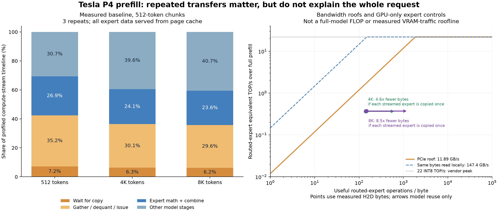

# Tesla P4 prefill: transfer reuse and chunk sizing

Independent measurements on 2026-10-09, motivated by [#1670](https://github.com/Niko1221/Strata/issues/1670) from @vizdatom. This is a results-only submission. The author's layer-major implementation was not used; no layer-major implementation is included here.

One Tesla P4, Qwen3.8-Flash-Next-GSQ-RCO IQ3_XXS, int8 KV, CUDA 12.0, GCC 12, driver 580.178.04, Ubuntu 24.04/kernel 7.0.0-31, dual Xeon E5-2697 v3, 251.773 GiB RAM. GPU 0 has an x16 link; the other two P4s were idle. Storage traffic was zero in measured runs with a warm page cache. Power limit and under-load link generation were not recorded.

| Prompt | Fixed 512, median of 3 | Existing auto, one run |
| --- | ---: | ---: |
| 4,096 tokens | 78.018453 tok/s | 107.259667 tok/s |
| 8,192 tokens | 78.840339 tok/s | 114.753823 tok/s |

Auto selected at most 1,792 tokens. Its instrumented controls disable CPU expert sharing. The matching instrumented fixed-512 controls reached 77.928650 and 78.933397 tok/s. This compares existing policies, not a speedup introduced by this PR.

At 8K/fixed-512, counters recorded 262.788941 GB of expert-copy payload versus 30.871322 GB of distinct streamed weights. Auto copied 193.275469 GB. These are host-to-GPU copy payloads, not physical disk reads. Explicit copy waits occupied 6.2% of the fixed-512 timeline, so byte reuse alone does not predict an equivalent runtime gain.

Read [the complete report](P4_PREFILL_ROOFLINE.txt) for phase timing, capacity, measured bandwidths, limitations, and exact provenance. [Summary JSON](roofline-summary.json) contains all calculated figures.

## Evidence and reproduction

`p4-roofline/` contains the repeated baseline; `control/` and `auto/` contain one measured request per length after warmup. Each has exact prompt token IDs, output IDs, per-request timing, launch configuration, and engine logs. All 16 requests completed with zero prompt reuse and the same single output token. This is not a multi-token quality/equality gate. Paths were normalized to `/home/bench`; numeric results and tokens were preserved.

Base source is `fb58e0dbc8399662c0e47c76578c6e878b14f6cf` (0.1.41). Controls use that base plus the exact 21-line `instrumentation.patch`, included only as a measurement artifact, not applied to engine source in this PR. `STRATA_PREFILL_ROOFLINE=1` counts primary-GPU expert copy payloads, copy calls, distinct bytes and distinct experts per prefill call. Peer copies and GPU DRAM transactions are excluded. The patch was built/tested on CUDA sm_61 only; HIP/SYCL were not built.

Build the base with CMake Release, CUDA enabled, architecture 61, `STRATA_EXPERIMENTAL_SM60=ON`, GCC/G++ 12, tests disabled. Dependency source revision: `3cf03257f219afbe7334045ff7c6a06ac68c627d`. For controls apply the attached patch before rebuilding. Copy a supplied config to a local file and replace executable, working directory, tokenizer, model shards, pack, MTP, profile and log paths. Use the same IQ3_XXS model and assets named in the configs. Full GGUF revision/hashes and custom pack/profile hashes were not captured for this run.

Run `p4_prefill_runner.py` in a Python environment with Strata's server dependencies. Set `ROOF_ROOT` to the checkout, `ROOF_OUT` to a fresh output directory, and `ROOF_CONFIG` to the edited config. Baseline uses three repetitions per length. Set `ROOF_CONTROL=1` for warmup plus one 4K and one 8K request; additionally set `ROOF_PREFILL=auto` for auto. Runs used 27 CPU workers, host NUMA interleave across both sockets and a 64 GiB memlock limit. The driver is adapted only to accept a local configuration path and avoid adding a duplicate mmap flag.

Bandwidth microbenchmarks: compile `p4_roofs.cu` with `nvcc -ccbin=/usr/bin/g++-12 -O3 -arch=sm_61 -lcublas`; compile `host_read.cpp` with `g++-12 -O3 -march=native -fopenmp`. GPU/pinned-transfer tests bind CPU/memory to NUMA node 0; host-read tests interleave across sockets. Recorded JSONL contains three trials each. The synthetic SGEMM measurements are not the actual IQ3 expert kernel.

Run `python analyze_roofline.py` with NumPy and Matplotlib to regenerate the summary and figure. The plot uses useful routed-expert equivalent operations and host-to-GPU bytes, not full-model hardware-counter FLOP utilization. Reuse arrows are not predicted speedups.

No RX 5500 XT, RTX 3070, layer-split, cold-storage, decode-speed, or general answer-quality measurements are claimed here. A future active-layer cache needs its own implementation and validation against auto.
