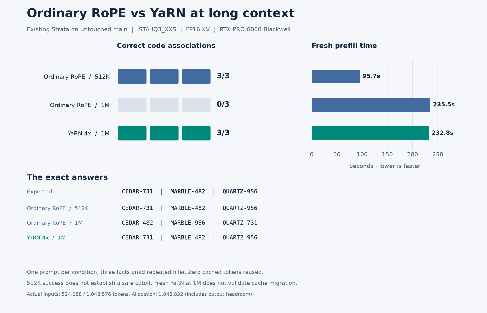

# Existing RoPE and YaRN at 512K and 1M



This report uses **Strata's existing YaRN implementation on unmodified main**.
It adds a reproducible probe, per-run measurements, and a figure; no inference
code, cache converter, or serving default changes are included.

## What this tells us about choosing RoPE settings

- **Within this artifact's declared 262,144-token context:** retain the normal
  model/setup defaults. This long-context probe does not establish that enabling
  YaRN permanently improves short requests.
- **Beyond the declared context:** Strata setup already selects experimental
  YaRN and a covering scale. Continue using that documented behavior. Ordinary
  RoPE's successful 512K probe is not evidence of a safe 512K cutoff.
- **At 1M:** compare the exact answers below. This is one three-fact retrieval
  prompt, not a general 1M quality certification or a measurement of where to
  switch scaling. No automatic quality acceptance threshold is used.

The model's context metadata is an artifact declaration, not independent proof
of its training history. YaRN changes positional behavior throughout the
conversation, including shorter positions. A process uses one RoPE configuration.

## Set up YaRN simply

YaRN is already in main; this PR is not required to enable it. For an existing
Strata installation, rerun setup with the desired total context capacity.

Linux:

```sh
./setup.sh --setup --context 1048576 --rope-scaling yarn --rope-scale 4
```

Windows:

```bat
START-HERE.bat --setup --context 1048576 --rope-scaling yarn --rope-scale 4
```

Stop the current server before rerunning setup. Select the model you want to
configure; `--setup` saves the new settings and starts it. On later launches,
run `./setup.sh` on Linux or `START-HERE.bat` on Windows to use the saved settings,
then send requests normally. For 512K,
use `--context 524288 --rope-scaling yarn --rope-scale 2`. That is the existing
setup policy; **YaRN 2x at 512K was not measured in this report**.
Setup chooses other options for your hardware, so these commands do not promise
the FP16 benchmark's memory use or speed on another GPU. Check the resolved
context and RoPE settings in the startup log.

When launching the native engine directly, add these to your existing model
arguments (replace any conflicting context/RoPE flags):

```sh
--max-context 1048576 --rope-scaling yarn --rope-scale 4 --yarn-orig-ctx 262144
```

The context capacity includes the prompt and generated reply: leave room for
output. The benchmark used a slightly larger allocation of 1,048,832 to test
an actual 1,048,576-token input plus its reply and engine headroom.

Example request to a local server after setup (change the port/key if configured):

```sh
curl http://127.0.0.1:8080/v1/chat/completions \
  -H 'Content-Type: application/json' \
  -H "Authorization: Bearer $STRATA_API_KEY" \
  -d '{"model":"strata","messages":[{"role":"user","content":"Write a Python function that returns the maximum of a nonempty list."}],"max_tokens":128,"temperature":0,"reasoning_effort":"none"}'
```

**Restart with the selected settings before starting the conversation.** Do not
restore an ordinary-RoPE KV session into a differently configured YaRN engine.
Replay the canonical conversation under YaRN to build matching state. This
report does not implement an in-place switch or validate approximate cache
migration followed by continuation to 1M.

See [Strata's existing context-extension documentation](../../../docs/DETAILS.md)
and the earlier [1M YaRN measurement, #348](https://github.com/Niko1221/Strata/issues/348).

## Workload and measurement boundaries

The user message contains three codes, separated by repetitions of ` apple`
and ` orange`. The final request is: “Return all three codes in order separated
by |. Nothing else.” The exact tokenizer/template renders the prompt to either
524,288 or 1,048,576 tokens. [probe.py](probe.py) constructs those IDs and records
their SHA-256; the two 1M conditions must have identical input hashes.

Expected answer:

```text
CEDAR-731|MARBLE-482|QUARTZ-956
```

Each condition starts a separate resident engine with no cached-prefix reuse.
The timed request starts after model loading. Prefill and decode rates come
from the engine's timing line; TTFT and total request time are also retained.
The output cap is 64 tokens; report the actual generated count. RAM is the
engine's Linux RSS high-water mark (including mapped/shared pages), and VRAM is
device-wide usage sampled approximately once per second. These are not
allocation-accounting totals. There are no other inference jobs on the GPU.

This is **one run per condition**, three expected associations, repeated filler,
and a short reply. No confidence intervals, percentile latency claims, broad
coding-quality claims, or safe switching boundary can be inferred. The names
and numbers being present but incorrectly paired is recorded as an association
error, not hidden by a substring-presence score.

## Reproduce

Use upstream main at `fb58e0dbc8399662c0e47c76578c6e878b14f6cf` and an existing
ISTA IQ3_XXS configuration. Build on the benchmark GPU:

```sh
cmake -S . -B build -DSTRATA_ENABLE_CUDA=ON \
  -DCMAKE_CUDA_ARCHITECTURES=120 \
  -DCMAKE_CUDA_COMPILER=/usr/local/cuda/bin/nvcc
cmake --build build -j8 --target strata

python bench/results/2026-10-09-rope-yarn-long-context/probe.py \
  --config strata.json --exe build/strata --tokens 1048576 \
  --rope yarn --output /tmp/strata-yarn-1m
```

For the ordinary-RoPE comparison, change only `--rope yarn` to `--rope none`
and choose a new output directory. For its 512K condition, also change
`--tokens` to `524288`. These are deliberate native-engine extrapolation probes;
setup itself refuses ordinary RoPE beyond the declared context.

The probe fixes FP16 KV, prefill 8192, MTP off, suffix drafting off, speculation
width 2, parked-conversation RAM cache off, CPU prefill share zero, deterministic
greedy decoding, and allocation capacity 1,048,832. Model/pack paths and the
expert profile come from the supplied configuration. It needs Strata's existing
Python environment; no separate evaluation service is used.

Run `python plot.py` in this directory to regenerate PNG and SVG figures from
`results.json` (requires matplotlib). Model weights, token caches, private
profiles, and credentials are not included.

<!-- MEASURED_RESULTS -->

## Measured results on untouched main

| Configuration | Actual input | Correct pairs | Fresh prefill | Prefill tok/s | Decode tok/s | Generated |
|---|---:|---:|---:|---:|---:|---:|
| Ordinary RoPE | 524,288 | 3/3 | 95.7 s | 5,479.2 | 103.6 | 22 |
| Ordinary RoPE | 1,048,576 | 0/3 | 235.5 s | 4,452.1 | 82.4 | 22 |
| YaRN 4x from token zero | 1,048,576 | 3/3 | 232.8 s | 4,504.8 | 82.7 | 22 |

All runs: RTX PRO 6000 Blackwell 96 GB, Ryzen 9 7950X, 124 GiB usable RAM,
Ubuntu 24.04.5, NVIDIA driver 595.91.07, CUDA 13.2.86, GPU power limit 400 W.
Main commit: `fb58e0dbc8399662c0e47c76578c6e878b14f6cf` (engine 0.1.41).
The model is ISTA-DASLab IQ3_XXS; its download revision was not recorded.
The expert profile matches upstream `data/expert-profile.bin` by SHA-256.

Peak sampled GPU usage: 70.8–70.8 GiB; engine RSS high-water mark: 43.3–43.4 GiB.

The two 1M input hashes match. All three use the same executable hash.
The 1M ordinary-RoPE answer was:

```text
CEDAR-482|MARBLE-956|QUARTZ-731
```

The 1M YaRN answer was:

```text
CEDAR-731|MARBLE-482|QUARTZ-956
```

See [results.json](results.json) for input/executable/profile hashes, launch arguments,
per-run TTFT/total time, resource observations, and all actual answers. No private development-build measurements are mixed into this table.
